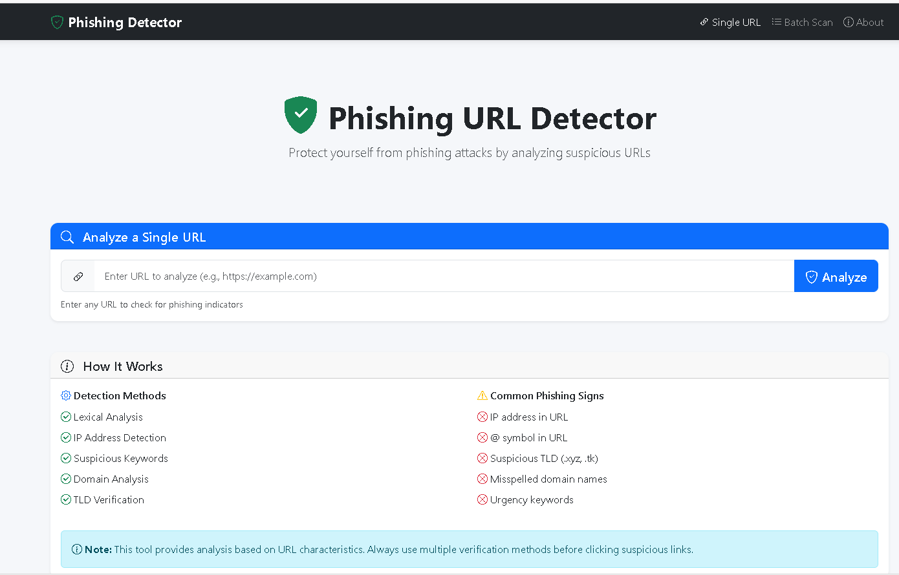

# 🔒 Phishing URL Detector

[](https://www.python.org/)
[](https://flask.palletsprojects.com/)
[](LICENSE)

A web-based tool that analyzes URLs to detect phishing attempts. This project uses multiple detection methods to identify suspicious URLs and helps protect users from online scams.



---

## 📋 Table of Contents

- [Features](#-features)
- [How It Works](#-how-it-works)
- [Installation](#-installation)
- [Usage](#-usage)
- [Detection Methods](#-detection-methods)
- [Project Structure](#-project-structure)
- [API Documentation](#-api-documentation)
- [Contributing](#-contributing)
- [License](#-license)

---

## ✨ Features

- **Single URL Analysis**: Analyze one URL at a time with detailed results
- **Batch Scanning**: Scan multiple URLs simultaneously
- **Risk Scoring**: Get a numerical risk score (0-100) for each URL
- **Detailed Warnings**: Understand why a URL was flagged
- **Recommendations**: Get actionable advice based on the analysis
- **Modern UI**: Clean, responsive web interface
- **REST API**: Easy integration with other applications

---

## 🔍 How It Works

The detector analyzes URLs using multiple techniques:

1. **Lexical Analysis**: Examines the structure and content of the URL
2. **Domain Analysis**: Checks domain characteristics and patterns
3. **Feature Extraction**: Extracts 15+ features from each URL
4. **Risk Scoring**: Calculates a risk score based on weighted features
5. **Classification**: Categorizes URLs as Safe, Suspicious, or Phishing

---

## 🚀 Installation

### Prerequisites

- Python 3.8 or higher
- pip (Python package manager)

### Quick Start

1. **Clone the repository**
   ```bash
   git clone https://github.com/YOUR_USERNAME/phishing-url-detector.git
   cd phishing-url-detector
   ```

2. **Create a virtual environment** (recommended)
   ```bash
   # Windows
   python -m venv venv
   venv\Scripts\activate

   # macOS/Linux
   python3 -m venv venv
   source venv/bin/activate
   ```

3. **Install dependencies**
   ```bash
   pip install -r requirements.txt
   ```

4. **Run the application**
   ```bash
   python app.py
   ```

5. **Open in browser**
   ```
   http://localhost:5000
   ```

---

## 💻 Usage

### Web Interface

1. Open `http://localhost:5000` in your browser
2. Enter a URL in the input field
3. Click "Analyze" to see the results
4. View risk score, warnings, and recommendations

### Batch Analysis

1. Click on "Batch Scan" tab
2. Enter multiple URLs (one per line)
3. Click "Scan All URLs" to analyze

### Command Line

You can also use the detector directly in Python:

```python
from utils.detector import PhishingDetector

# Initialize detector
detector = PhishingDetector()

# Analyze a URL
result = detector.analyze('https://suspicious-site.com')

# Print results
print(f"Risk Level: {result['risk_level']}")
print(f"Risk Score: {result['risk_score']}")
print(f"Warnings: {len(result['warnings'])}")
```

### Extract Features Only

```python
from utils.url_features import URLFeatureExtractor

# Extract features from a URL
extractor = URLFeatureExtractor('https://example.com')
features = extractor.get_all_features()

for feature, value in features.items():
    print(f"{feature}: {value}")
```

---

## 🛡️ Detection Methods

The detector checks for the following phishing indicators:

| Feature | Description | Weight |
|---------|-------------|--------|
| **IP Address in URL** | URLs using IP instead of domain | High (25) |
| **@ Symbol** | Classic phishing redirect trick | High (30) |
| **Double Slash** | Possible redirect attempt | High (20) |
| **HTTPS in Domain** | Deception technique | High (25) |
| **Suspicious Keywords** | Words like "login", "verify" | Medium (15) |
| **Suspicious TLD** | Cheap TLDs (.xyz, .tk, etc.) | Medium (15) |
| **Dash in Domain** | Mimicking legitimate sites | Medium (10) |
| **Multiple Subdomains** | Confusion technique | Medium (12) |
| **Encoded Characters** | Hiding malicious content | Low (10) |
| **Port Number** | Unusual for normal websites | Low (8) |

### Risk Level Thresholds

| Level | Score Range | Description |
|-------|-------------|-------------|
| 🟢 **Safe** | 0-14 | No significant phishing indicators |
| 🟡 **Suspicious** | 15-34 | Some concerning characteristics |
| 🔴 **Phishing** | 35+ | Multiple dangerous indicators detected |

---

## 📁 Project Structure

```
phishing-url-detector/
│
├── app.py                 # Flask application entry point
├── requirements.txt       # Python dependencies
├── README.md              # Project documentation
│
├── utils/                 # Core detection modules
│   ├── __init__.py
│   ├── url_features.py    # Feature extraction
│   └── detector.py        # Detection engine
│
├── templates/             # HTML templates
│   └── index.html         # Main page
│
├── static/                # Static assets
│   ├── css/
│   │   └── style.css      # Custom styles
│   ├── js/
│   │   └── main.js        # Frontend logic
│   └── images/
│       └── screenshot.png # Demo screenshot
│
└── tests/                 # Unit tests (optional)
    └── test_detector.py
```

---

## 📡 API Documentation

### POST /analyze

Analyze a single URL.

**Request:**
```json
{
    "url": "https://example.com"
}
```

**Response:**
```json
{
    "success": true,
    "result": {
        "url": "https://example.com",
        "risk_score": 15,
        "risk_level": "suspicious",
        "features": {...},
        "warnings": [...],
        "recommendations": [...]
    }
}
```

### POST /batch

Analyze multiple URLs.

**Request:**
```json
{
    "urls": [
        "https://url1.com",
        "https://url2.com"
    ]
}
```

**Response:**
```json
{
    "success": true,
    "results": [...],
    "total": 2
}
```

### GET /api/features/\<url\>

Get raw features for a URL.

---

## 🧪 Testing

Run the test suite:

```bash
# Test the feature extractor
python -m utils.url_features

# Test the detector
python -m utils.detector

# Run unit tests (if available)
pytest tests/
```

---

## 🤝 Contributing

Contributions are welcome! Here's how you can help:

1. Fork the repository
2. Create a feature branch (`git checkout -b feature/amazing-feature`)
3. Commit your changes (`git commit -m 'Add amazing feature'`)
4. Push to the branch (`git push origin feature/amazing-feature`)
5. Open a Pull Request

### Ideas for Contributions

- Add machine learning model for better detection
- Integrate with URL reputation services
- Add browser extension
- Improve UI/UX
- Add more test cases

---

## 📄 License

This project is licensed under the MIT License - see the [LICENSE](LICENSE) file for details.

---

## ⚠️ Disclaimer

This tool is for educational and defensive purposes only. It provides analysis based on URL characteristics and should not be the sole method for determining URL safety. Always:

- Use multiple verification methods
- Keep your software updated
- Be cautious with unsolicited links
- Report phishing to relevant authorities

---

## 📞 Contact

**Your Name** - Cybersecurity Engineer

- GitHub: [@yourusername](https://github.com/yourusername)
- LinkedIn: [Your Profile](https://linkedin.com/in/yourprofile)

---

## 🙏 Acknowledgments

- Inspired by various phishing detection research papers
- Thanks to the open-source community for tools and libraries
- Bootstrap for the UI components

---

⭐ If you found this project useful, please give it a star!
